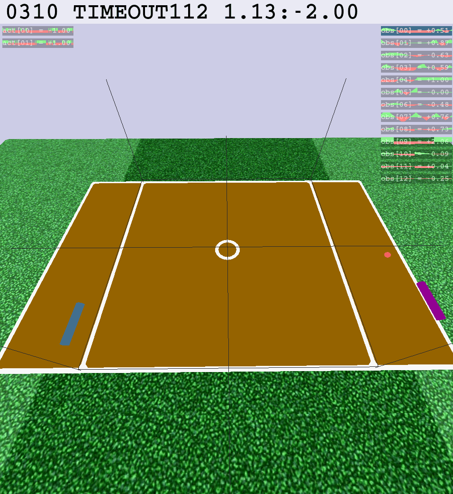

# Student Project for the Reinforcement Learning Course of Prof. Jochen Triesch
A student project comparing two different Reinforcement Learning approaches on the OpenAi Gym Roboschool Pong environment.
During this project, a team of 4 students implemented two reinforcement learning algorithms to compare them in a multi-agent environment. As most RL algorithms are only compared by their respective performance in a given environment, we found it more interesting to pit them against each other in a multi-agent tournament.
The two algorithms which we chose were the REINFORCE policy gradient (William 1988) and the Deep-Q Network (Mnih et al. 2015) as those two are representative of two different families of reinforcement learning algorithms. In this repository, DQN was implemented by Frederike Kubandt and Pierre Schumacher. Specifically, we train a Double DQN agent against itself, using shared parameters. 

## Dependencies 
- gym==0.12.5
- roboschool==1.0.49
- tensorboardX==2.0
- torch==1.4.0
- torchvision==0.5.0
- numpy==1.18.1

 ## Usage
```shell
$ python3 main.py
```


This trains the model against itself.
```shell
$ python3 play.py
```

This loads the trained model and shows its performance against the default Pong opponent.


